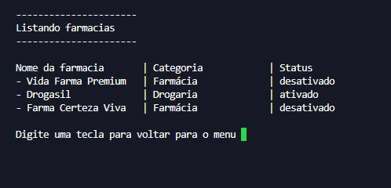
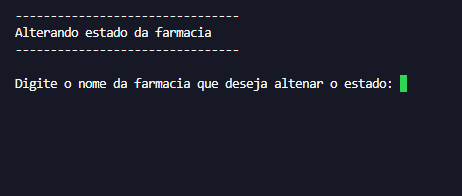

# Sistema de Cadastro de Farmácias em Python

Este projeto foi desenvolvido durante meus estudos iniciais em Python com o objetivo de praticar lógica de programação e estruturação de código.

O sistema funciona via terminal (CLI) e permite o gerenciamento de farmácias com as seguintes funcionalidades:

## Funcionalidades

- Cadastrar novas farmácias
- Listar farmácias cadastradas
- Ativar/Desativar farmácias
- Menu interativo no terminal

## Conceitos aplicados

Neste projeto foram aplicados:

- Lógica de programação
- Funções
- Listas
- Dicionários
- Estruturas condicionais
- Estruturas de repetição
- Entrada e saída de dados
- Organização de código
- Docstrings (documentação de funções)

## Como executar o projeto

1. Clone o repositório
2. Abra o terminal ou Prompt de Comando na pasta do projeto
3. Execute o arquivo Python:


## Demonstração do Sistema

### 1. Menu Principal
O menu principal do sistema exibe as opções de cadastro, listagem e alteração de status das farmácias.  


---

### 2. Listagem de Farmácias
Mostra todas as farmácias cadastradas, com nome, categoria e status (ativado/desativado).  


---

### 3. Alterando o Status de uma Farmácia
Permite ativar ou desativar uma farmácia existente.  



```text
python app_farmacias.py
